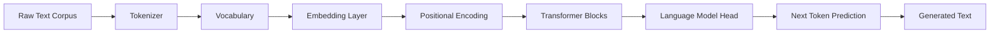
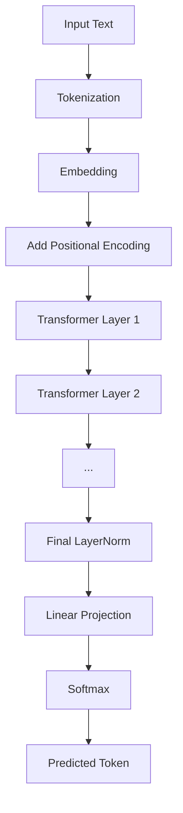
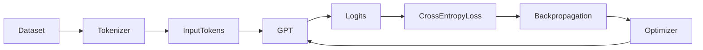
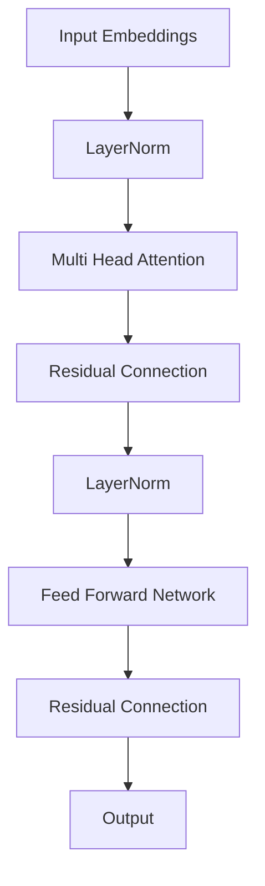
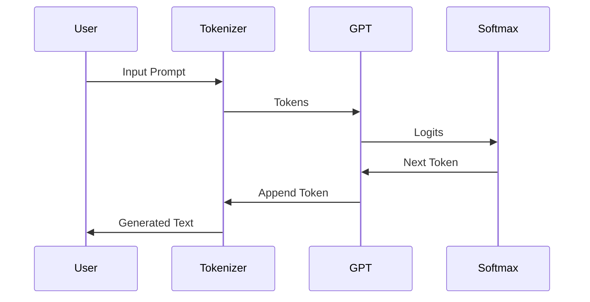

# 🤖 NeetCode GPT

> **Building GPT from scratch — one concept at a time.**

A complete implementation of a **Generative Pre-trained Transformer (GPT)** built from scratch while completing the **NeetCode Machine Learning Course**. The goal of this repository is to understand every building block of modern Large Language Models instead of treating them as black boxes.

---

# ✨ Features

* 🧠 Neural Networks from scratch
* 📚 Tokenization (Character & BPE)
* 🔤 Vocabulary Construction
* 🔢 Embeddings & Positional Encoding
* ⚡ Self Attention
* 👥 Multi-Head Attention
* 🏗️ Transformer Blocks
* 🚀 GPT Language Model
* ✍️ Autoregressive Text Generation

---

# 🏛️ Project Architecture



---

# 🧠 GPT Pipeline



---

# 🔄 Training Workflow



---

# ⚙️ Transformer Block



---

# 📂 Repository Structure

```text
neetcode-gpt/
│
├── tokenizer/
├── datasets/
├── embeddings/
├── attention/
├── transformer/
├── gpt/
├── training/
├── inference/
├── utils/
├── notebooks/
├── requirements.txt
└── README.md
```

---

# 📖 Concepts Covered

## Neural Networks

* Forward Propagation
* Backpropagation
* Gradient Descent
* Activation Functions
* Loss Functions

---

## Natural Language Processing

* Character Tokenization
* Byte Pair Encoding (BPE)
* Vocabulary Building
* Embedding Layers

---

## Transformers

* Self Attention
* Scaled Dot Product Attention
* Multi Head Attention
* Layer Normalization
* Feed Forward Networks
* Residual Connections
* Positional Encoding

---

## GPT

* Decoder-only Transformer
* Autoregressive Generation
* Cross Entropy Loss
* Causal Masking
* Next Token Prediction

---

# 🛠️ Installation

```bash
git clone https://github.com/Aditsharma12/neetcode-gpt.git

cd neetcode-gpt

pip install -r requirements.txt
```

---

# 🚀 Usage

Train the model

```bash
python train.py
```

Generate text

```bash
python generate.py
```

---

# 🔍 How GPT Generates Text



---

# 🎯 Learning Objectives

This repository focuses on understanding:

* Transformer internals
* Attention mechanisms
* Language model training
* Tokenization algorithms
* Building GPT from first principles
* Modern LLM architecture

---

# 📚 References

* NeetCode Machine Learning Course
* Attention Is All You Need (2017)
* GPT-2 (OpenAI)
* The Illustrated Transformer

---

# ⭐ Repository Goals

This project is intended as an educational implementation for anyone interested in learning how modern Large Language Models are built from scratch.

If you find this repository useful, consider giving it a ⭐.

---

# 📜 License

This project is released for educational purposes.
